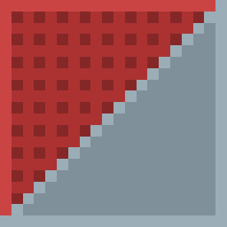

  

<h1 align="center">3DCheck</h1>

  <strong>See what’s wrong with a mesh before it ships.</strong> 
  Desktop analyzer for polygon waste, broken normals, missing tessellation, and overall optimization.

  
  
  

---

3DCheck opens a 3D model, scores how production-ready the geometry is, and shows every defect **on the mesh itself** — not just as a list of warnings.

It is built for game artists, technical artists, and anyone who needs a fast second opinion on topology before export.

## What it checks

| Check | What you learn |
| --- | --- |
| **Excess polygons** | Planar regions triangulated far past what the silhouette needs, plus degenerate zero-area faces |
| **Overdense mesh** | Smooth curved surfaces that are tessellated way too hard |
| **Missing polygons** | Creases and curves that still look faceted and need more subdivision |
| **Normals** | Flipped faces, inconsistent winding, inverted volumes |
| **Vertices** | Duplicates, tight clusters, and stray verts sitting off the mesh |

Every issue gets a severity, a penalty, and a short hint with a practical fix (Blender cleanup, decimate, retopology).

The **score is 100 minus those penalties**. Grades range from *excellent optimization* down to *rebuild the model*.

## Optimization potential

After the checks, 3DCheck estimates how much the mesh can still lose:

- polygons you can realistically drop
- remaining face count
- current file size vs. a lighter export
- expected savings in KB/MB and percent

This is a geometry-based estimate, not a promise that one click in Blender will hit the same number.

## Viewer

The OpenGL viewport is the other half of the report.

- Rotate, pan, zoom, wireframe, screenshot
- Color layers for each defect type — toggle them independently
- **X-ray** draws hidden problem faces through the model
- Dark / light UI, Russian and English

Controls: LMB rotate · RMB or Shift+LMB pan · wheel zoom · double-click reset.

## Formats

`OBJ` · `STL` · `PLY` · `GLB` · `glTF` · `OFF` · `3MF` · `DAE`

## Run it

**Windows build** — launch `3DCheck.exe` or `run` in the repo root.

Pass a file path as an argument to open it on startup.

## Stack

Python, CustomTkinter, OpenGL (`pyopengltk`), trimesh, NumPy, SciPy.

## License

[GPL-3.0](LICENSE)
